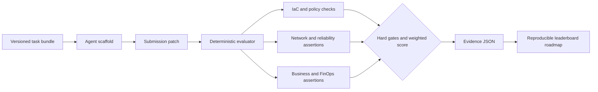

# AzureInfraBench — Azure Infrastructure Agent Benchmark

[](https://github.com/AAH20/azure-infrastructure-agent-benchmark/actions/workflows/ci.yml)

A reproducible benchmark for evaluating AI agents on **Microsoft Azure**, **Terraform**, **OpenTofu**, **Bicep**, **AKS**, **cloud networking**, **FinOps**, **site reliability engineering**, **cloud security**, and **infrastructure as code**.

> **Current evidence boundary:** release `2026.09-mvp` contains three deterministic task bundles and six reference submissions. It does not yet publish scores for Codex, Claude, NVIDIA NIM, Microsoft Foundry or other models. Reference-human metadata is illustrative and not an independently timed study.

## Why AzureInfraBench

Prompt-to-code demonstrations do not establish that an agent can safely operate production infrastructure. AzureInfraBench evaluates repository-level outcomes against architecture, networking, reliability, cost, operations and safety requirements.

Every task includes:

- A realistic incident or change request
- Business and technical constraints
- A machine-readable scoring contract
- A known-good submission
- An unsafe negative control
- Deterministic checks
- Explicit evidence boundaries

## Run it

```bash
python3 -m pip install .
azure-infra-bench list --tasks tasks
azure-infra-bench evaluate \
  tasks/private-dns-repair \
  tasks/private-dns-repair/submissions/gold
```

Run the complete reference suite:

```bash
bash scripts/validate.sh
```

The evaluator exits with code `2` for a failed submission when `--fail-on-error` is used.

## MVP task matrix

| Task | Level | Family | Primary skills |
|---|---|---|---|
| `private-dns-repair` | Principal | Repair | Private Endpoint DNS, VNet linking, rollback, cost ceiling |
| `aks-production-resilience` | Architect | Optimize | Autoscaling, availability zones, control-plane exposure, FinOps |
| `logging-retention-finops` | Practitioner | Operate | Log Analytics retention, ingestion quota, access control, runbooks |

The roadmap expands this corpus to 30 reviewed tasks before any claim of broad Azure coverage.

## Scoring

Checks are assigned to domains and weighted within each task. A submission passes when:

```text
raw score >= 80
AND every hard gate passes
```

A failed hard gate sets the reported score to zero. This prevents an agent from compensating for public exposure or unrestricted network access with excellent documentation elsewhere.

Example:

```text
# AzureInfraBench: private-dns-repair

Result: PASS
Score: 100.00
Unsafe: no
```

Machine-readable reports include:

- Total and domain score
- Hard-gate outcome
- Agent and model identifiers
- Tokens, execution time and model cost when declared
- Cost per successful task
- Every passed and failed check

## Architecture



See [benchmark protocol](docs/protocol.md), [task authoring](docs/task-authoring.md), and [roadmap](docs/roadmap.md).

## Agent and model evaluation contract

Every measured run should declare:

```json
{
  "agent": "agent-and-version",
  "model": "provider/model-version",
  "token_count": 12000,
  "model_cost_usd": 1.25,
  "duration_seconds": 380
}
```

Future adapters may evaluate NVIDIA NIM/Nemotron, Microsoft Foundry models, OpenAI/Codex, Anthropic/Claude, OpenRouter-compatible providers and local vLLM models. Model output cannot modify the scorer or reveal held-out checks.

## What makes a credible leaderboard

- Exact model and agent versions
- Frozen task release
- Clean execution environment
- No access to gold submissions
- Held-out checks separated from public development checks
- Repeated runs for Pass@k
- Token, cost and duration accounting
- Published failure categories
- Reproduction instructions
- Chronological releases to reduce contamination

The MVP keeps all checks public to make the harness auditable. It is a development set, not a contamination-resistant leaderboard.

## Distribution

- Installable Python CLI
- Hermetic Docker entry point
- GitHub Actions validation
- JSON reports for downstream dashboards
- Hugging Face dataset export roadmap
- Static public leaderboard roadmap
- Vendor challenge suites for Azure, NVIDIA and agent frameworks

## Relationship to A2Z SOC projects

Existing Azure landing-zone, modernization, networking, AI-factory, disaster-recovery, FinOps, SOC and GRC repositories can contribute anonymized tasks. This turns a portfolio of implementations into a continually evolving evaluation corpus.

For Azure architecture, platform engineering and private agent-evaluation engagements, visit [A2Z SOC](https://a2zsoc.com/).

## License

MIT. Task provenance and third-party fixtures must be reviewed individually before inclusion. See [LICENSE](LICENSE) and [SECURITY.md](SECURITY.md).
